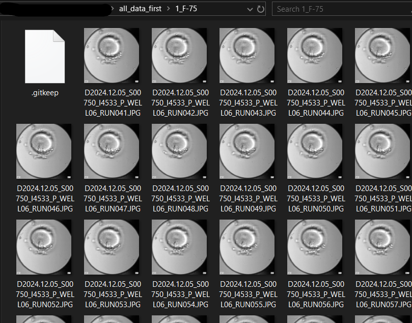

## Prerequisites

Before running this project, ensure that you have the following installed:

- **Python**: Make sure Python is installed on your system. You can download it from the [official Python website](https://www.python.org/). Install Python 3.11 and up.

To verify your Python installation, run:

```bash
python --version
```

or for some systems:

```bash
python3 --version
```

### Folder structure
The images of the embryo for a given focal plane should be pasted into the corresponding focal folder located in "all_data_first". 
Here is an example for one of the focal planes: 

## Installation Instructions

1. Clone the repository and navigate to the project directory:
   ```bash
   git clone <repository_url>
   cd <repository_directory>
   ```

2. Install the required dependencies by running:

   ```bash
   pip install -r requirements.txt
   ```

### Optional Step

If you'd like to ensure your `pip` is updated before installing dependencies, you can use the following command:

```bash
pip install --upgrade pip && pip install -r requirements.txt
```

This will upgrade `pip` to the latest version and then install the required dependencies.
